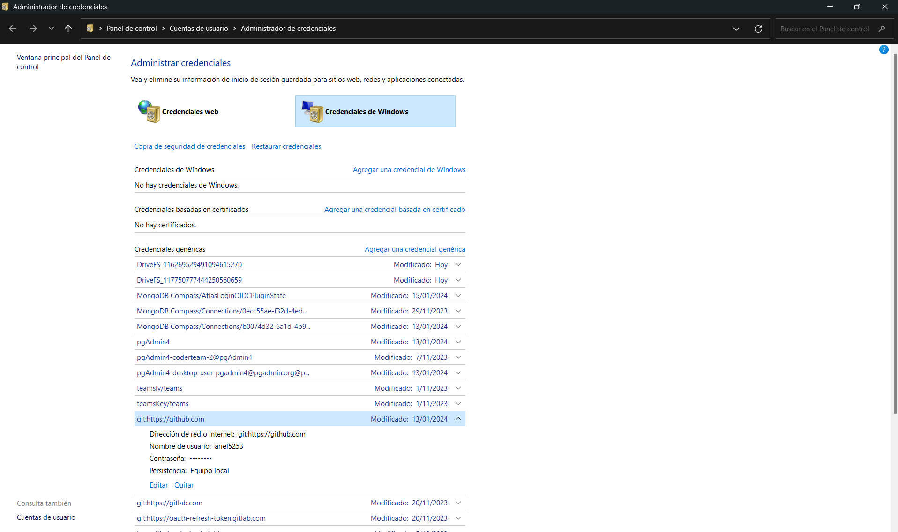

# Resumen de la sesión 02 del 15 de febrero

## Origen de los lenguajes de programación

- Nota: Para ser lenguaje de programación debe permitir ejecutar operaciones lógicas, aritméticas y relacionales.

## Comandos de git 

1. Primer paso: configurar git
```
    git config --global user.name "John Doe"
    git config --global user.email johndoe@example.com
``` 

2. Segundo paso: Verificar autenticación
    
    - Ir a credenciales de Windows
    - Credenciales de Windows
    - Buscar autenticación de git 
    - Eliminar autenticación

 

3. Tercer paso: Clonar el repositorio
```
    git clone https://github.com/ariel5253/ariel5253.git
```

4. Cuarto paso: Obtener cambios del repositorio de la nube
```
    git pull
```

5. Quinto paso: Lanzar cambios al repositorio de la nube
```
    git pull
    git add -A
    git commit -m "cambios"
    git push
```
